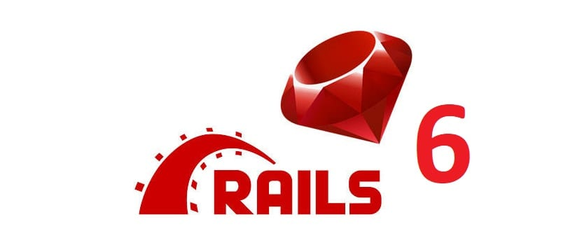
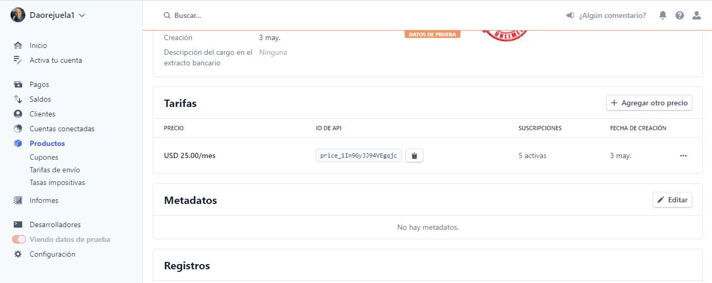

[](https://GitHub.com/Naereen/StrapDown.js/graphs/commit-activity) [](http://lbesson.bitbucket.org/) [](https://lbesson.mit-license.org/) [](https://github.com/Naereen/badges)  [](https://GitHub.com/Naereen/)

<p align="center">
  
</p>

#  Our Warehouse

> **(Store your items & organize your team)**

Our warehouse is a Saas (Software As A Service) App that allows users to store items in boxes and share them with a team, at the same time that they indicate what items are being actually used.

<p style="font-size:25px; font-weight:bold"> 

</p>
</center>

Payment using the Stripe test mode has been applied.

### Team 🎮

 [David Orejuela](https://github.com/daorejuela1) <br>  Software Developer|
| -------------- |
 
| <a href="https://twitter.com/DavidOrejuela14" ></a> &nbsp;<a href="https://www.linkedin.com/in/davidorejuela14/" ></a> <a href="https://medium.com/@daorejuela1" ></a>|

## Motivation 🏋

This software is a 1-week challenge created to test our technical knowledge using Ruby on Rails.

## Main logic 🧠

If the user is not logged into the app then he can pick a plan to register, login or receive an email from an admin to create the account:


 [Complete image to explore](https://share.balsamiq.com/c/33cH2nfDXLzEidjCaNJhwR.png)
 	
As an admin user (The Team creator) you can invite and see the billing information of your current team, create boxes, move items, add items, and use items.
 
 [Complete image to explore](https://share.balsamiq.com/c/agdD8ht28pPMiMYqiBk4qb.png)

As a regular user you can create boxes, move items, add items, use items, but you are not allowed to invite or see/change the billing information of your current team.

## Code style 👓


Rubocop ☞ [](https://github.com/rubocop/rubocop)

## Demo📷
<center>

## Stripe payment
<p style="font-size:25px; font-weight:bold"> 

</p>

--------------

## Change your billing information
<p style="font-size:25px; font-weight:bold">

</p>

--------------

## Invite users to your team

<p style="font-size:25px; font-weight:bold">

</p>

--------------
## Create box with QR images & items
<p style="font-size:25px; font-weight:bold">

</p>

--------------
## Move items
<p style="font-size:25px; font-weight:bold">

</p>

## Use items
<p style="font-size:25px; font-weight:bold">

</p>

## Tech used 🛠



Contact Importer was created using Ruby on Rails, additionals gems used to simplify the logic were used: 

 
| Gem  | Utility |
|----------------------------------------|--|
|  Devise                                       | Simplifies user session logic |
|  Devise Invitable| Allows devise to create users by sending emails |
|  pagy | Simplifies loading objects into the view with a pagination logic |
 |  Pay| Makes it easy to connect payment methods with models |
 |  Stripe - Stripe event| To simplify the use of the Stripe API |
 |  Dotenv| Handles env variables by placing them in a `.env` file| 
## Requirements 📚

- Ubuntu 18.04+
- Ruby 2.7+
- Rails 6+
- Postgres 1.8+
- Stripe account
- Stripe CLI


## Installation & Init 📖

Please make sure that you have installed the essentials and rails 6+ before cloning:

```
sudo yum install -y git-core zlib zlib-devel gcc-c++ patch readline readline-devel libyaml-devel libffi-devel openssl-devel make bzip2 autoconf automake libtool bison curl sqlite-devel redis-server
```

Set your products in the stripe dashboard & extract their product keys into the STRIPE_FREE_PLAN, STRIPE_MODERATE_PLAN, STRIPE_UNLIMITED_PLAN respectecly in the [stripe product dashboard](https://dashboard.stripe.com/test/products). 




After setting up the products configure what the user can do in the billing portal, using the [stripe billing portal](https://dashboard.stripe.com/test/settings/billing/portal).


Set the following env variables:

|  Key| Value |
|--|--|
| STRIPE_PUBLIC_KEY  | Public key from your Stripe dashboard|
| STRIPE_PRIVATE_KEY | Private key from your Stripe dashboard|
| STRIPE_SIGNING_SECRET | This key will be given after you run the `stripe listen --forward-to localhost:3000/pay/webhooks/stripe` command| 
| STRIPE_FREE_PLAN| Id of the Free Plan subscription|
| STRIPE_MODERATE_PLAN| Id of the Moderate Plan subscription|
| STRIPE_UNLIMITED_PLAN| Id of the Unlimited Plan subscription|

To install the stripe CLI [follow this link](https://stripe.com/docs/stripe-cli)

This software uses the dotenv gem so you can create a .env file in the app to showcase this keys.

1. Clone the repository: `git clone https://github.com/daorejuela1/our-warehouse`
2. Go to the folder: `cd our-warehouse`
3. Install gems in requirements `bundle`
4. Create the data base `rails db:create`
5. Run the migrations `rails db:migrate`
6. Start the stripe webhook  `stripe listen --forward-to localhost:3000/pay/webhooks/stripe`
8. Run the server: `rails s -b 0.0.0.0 -p 3000`

## Usage 💪

Get into the URL `127.0.0.1:3000`  to start the app, and sign up with a new account test credit cards can be found here [Stripe test cards](https://stripe.com/docs/testing): 

## Features 📜
 
 ### Stripe payment
 

 - You can use stripe to have a recurrent payment.

### Change your billing information

- You can change your billing information and check how long have you been paying and change your credit card information.

### Invitate Users

- You can invitate new users, by putting their E-mail.

### Create box with QR images & items

 - You can create boxes with a QR image that links to the box object.


### Move items

- You can move items from one box to another

### Use Items

- You can mark items as in used so other people know what's available


## Related projects 💼

Here are some awesome projects I have been working on:

|[Mastermind Hackday Project](https://github.com/daorejuela1/mastermind)| [Daily tweet](https://github.com/daorejuela1/daily_tweet) | [Monty bytecode decoder](https://github.com/daorejuela1/monty) | [Serpent Algorithm](https://github.com/daorejuela1/serpent) | [Custom Shell v2](https://github.com/daorejuela1/shell_v2)
|--|--|--|--|--|
|  |  |  |  |  |

## Credits ✈

Special thanks to [koombea.com](https://www.koombea.com/) for letting me be part of this awesome challenge.
